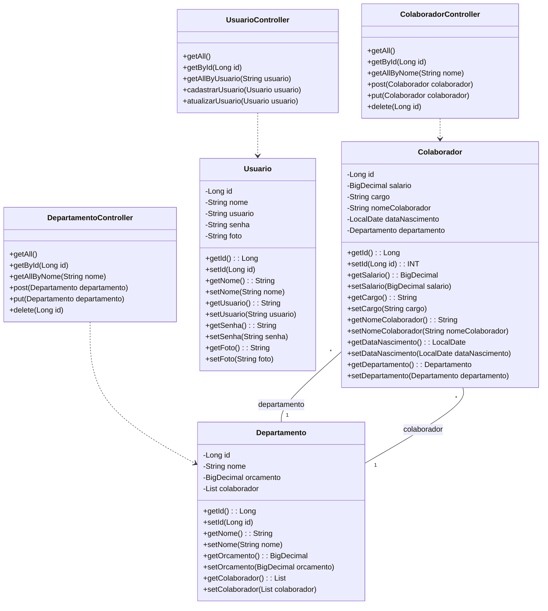

# Core Humans - Sistema de Gestão de Recursos Humanos

<br />

<div align="center">
  
</div>


<br />

## 📌 Descrição

*O Core Humans é uma plataforma integrada de Recursos Humanos, projetada para centralizar e otimizar a gestão de colaboradores, departamentos e usuários no sistema da sua organização.*

------

## 🚀 Sobre este Sistema

O Sistema Core Humans oferece um conjunto robusto de ferramentas para gerenciar colaboradores, departamentos e usuários do sistema. Com endpoints claros e seguros, o Core Humans simplifica as operações de cadastro e consulta de dados essenciais de RH.

### Principais Funcionalidades

1.  **Gestão de Colaboradores:**
    Cadastro, Leitura, Atualização e Exclusão (CRUD ) Busca: Todos, Por ID e Busca por nome da classe colaboradores.
2.  **Gestão de Departamentos:**
    Cadastro, Leitura, Atualização e Exclusão (CRUD) Busca: Todos, Por ID e Busca por nome da classe departamentos.
3.  **Gestão de Usuários:**
    Cadastro, Leitura e Atualização (CRUD) Busca: Todos, Por ID e Busca por usuários do sistema (para acesso e permissões).
4.  Relacionamento de Colaboradores a Departamentos.

------

## 🧩 Diagrama de Classes (Simplificado)



------

## 🗃️ Diagrama Entidade-Relacionamento (DER)

<div align="center">
    
</div>

------

## 🛠️ Tecnologias utilizadas

| Item                          | Descrição           |
| ----------------------------- | ------------------- |
| **Servidor**                  | Tomcat              |
| **Linguagem de programação**  | Java                |
| **Framework**                 | Spring              |
| **ORM**                       | JPA + Hibernate     |
| **Banco de dados Relacional** | MySQL               |

------

## 🧪 Configuração e Execução

1. Clone o repositório do Projeto [Projeto_02_Backend](https://github.com/Cavaleiros-Templarios/Projeto_02_Backend) dentro da pasta do *Workspace* do Eclipse/STS

```bash
git clone https://github.com/Cavaleiros-Templarios/Projeto_02_Backend
```a

2. **Abra o Eclipse/STS** e selecione a pasta do *Workspace* onde você clonou o repositório do projeto
3. No menu superior do Eclipse/STS, clique na opção: **File 🡲 Import...**
4. Na janela **Import**, selecione a opção: **General 🡲 Existing Projects into Workspace** e clique no botão **Next**
5. Na janela **Import Projects**, no item **Select root directory**, clique no botão **Browse...** e selecione a pasta do Workspace onde você clonou o repositório do projeto
6. O Eclipse/STS reconhecerá automaticamente o projeto
7. Marque o Projeto_01_Backend no item **Projects** e clique no botão **Finish** para concluir a importação


```
## 📬 Contato

Desenvolvido por:

- [**Wesley Lima**](https://github.com/Wezzlim)  
- [**Alex Ikezili**](https://github.com/alexikezili)  
- [**Gustavo Brassaroto Lira**](https://github.com/Brassaroto)  
- [**Cristiano Forner**](https://github.com/cristianoforner)  
- [**Fabricio Vicente Soares**](https://github.com/Fabriciovics)  
- [**Marcos Meneses**](https://github.com/MarcosvMeneses)  
- [**Pedro Henrique**](https://github.com/phccoelho)  
- [**Thiago Tasseli**](https://github.com/tasselii)  

Fique à vontade para tirar dúvidas, dar sugestões ou contribuir! 😄
